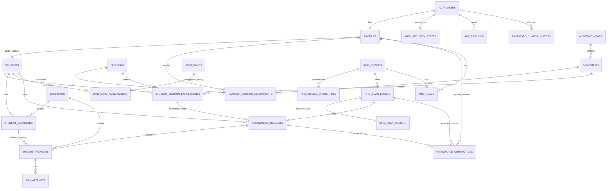

# RFID Student Attendance Database Architecture

Status: production-oriented baseline under explicit assumptions below. Resolve all items in **Missing decisions** before production deployment.

## 1. Confirmed requirements

- Scope is BSIT only. No college, program, or course catalog is needed.
- Exactly five sections are active in current implementation. Sections are database rows, not application constants.
- Supabase `auth.users` owns credentials. `public.profiles` owns application identity and one of three roles: `ADMIN`, `TEACHER`, or `STUDENT`.
- Role determines panel redirect and authorization. Role data must come from trusted database state or signed JWT custom claim, never `user_metadata` supplied by user.
- Parents and guardians have no authentication accounts.
- Student, guardian, and relationship are separate. Relationship row controls SMS opt-in. `students` is the canonical official student identity; linked profile names are synchronized mirrors.
- Academic year, semester, and student section enrollment are separate. One student has no more than one section in one semester. Past enrollments remain.
- RFID card and assignment are separate. UID is globally unique after canonicalization. Assignment history remains after loss, damage, disablement, return, or replacement.
- One student and one card each have no more than one active assignment.
- Every structurally valid, authenticated device request inserts immutable raw event before interpretation.
- Device event key is database-idempotent. Network retry does not duplicate attendance or SMS queue rows.
- Invalid UID, unknown card, unassigned card, disabled/lost card, duplicate tap, invalid OUT, disabled device, and processing error remain queryable.
- Attendance is separate from raw scan. Each accepted attendance row references exactly one source scan.
- PostgreSQL stays in UTC. Attendance dates and every daily constraint use fixed `Asia/Manila`; no rule casts a scan timestamp directly to a UTC date.
- Per `Asia/Manila` local date, each student has at most one valid `IN` and one valid `OUT`.
- SMS delivery is asynchronous. Attendance does not call provider. Logical notification and physical attempts are separate.
- Notification stores recipient name, exact E.164 phone, message, and type snapshots.
- Corrections retain source scan and original values. Approved change updates current attendance values, increments revision, and retains correction ledger.
- Important changes create append-only audit rows.
- Timestamps use `timestamptz`; business-local date uses `date`; IDs use UUID except singleton setting key.
- All application-owned columns use lower camel case. Multiword PostgreSQL identifiers are double-quoted; table names remain snake case.
- Foreign keys use `ON UPDATE RESTRICT ON DELETE RESTRICT`. No historical cascade delete exists.
- RLS protects exposed tables. Service/secret key stays only in trusted backend or worker, never browser or ESP32.

## 2. Missing decisions

These are product decisions, not database facts:

1. Official codes and names for five BSIT sections.
2. Whether a future policy will move the attendance boundary away from Manila midnight. Current implementation uses calendar midnight in `Asia/Manila`.
3. Which physical readers, if any, should use `IN_ONLY` or `OUT_ONLY`. Initial readers use `AUTO`.
4. Duplicate-tap window and whether equality at boundary counts duplicate.
5. Offline ESP32 buffering. If supported, maximum clock skew, trusted timestamp rules, and event ordering policy are needed.
6. Whether first tap after missing prior-day `OUT` is always new-day `IN`.
7. Semester naming and whether summer/intersession exists.
8. Class schedule, holidays, excused absences, late thresholds, and required attendance days. Without these, `NO_SCAN` is not safely called `ABSENT`.
9. Whether teacher authorization includes only current assignment, past assigned terms, or a date-bounded teaching interval.
10. Whether teachers may see guardian names/phone numbers. Baseline denies teacher guardian access.
11. SMS provider, country rules, sender ID, maximum message segments, templates, languages, quiet hours, opt-out/legal requirements, and provider idempotency support.
12. Whether a guardian may have multiple destination numbers. Baseline stores one current number per guardian.
13. SMS correction behavior: leave original notification unchanged, cancel unsent message, or send explicit correction message.
14. Who may request corrections. Baseline allows student for self, teacher for authorized section, and admin; only admin approves.
15. Data retention, archival, anonymization, and privacy policy for scans, phone numbers, SMS payloads, audit logs, and device payloads.
16. User provisioning: invite-only, admin-created, or self-signup. Baseline requires admin provisioning; public signup should be disabled.
17. Production deployment topology for rate limits. The current ordinary-plan IP limiter is process-local best effort; horizontally scaled production needs a shared store such as Redis.
18. Official Cloudflare Turnstile keys and final escalation thresholds. Current defaults require CAPTCHA after 3 account failures or 10 IP failures in one hour and block at 5/20.

## 3. Explicit assumptions used by migration

1. PostgreSQL/session timezone is UTC. The institution attendance timezone is locked to `Asia/Manila`.
2. Database `receivedAt` is authoritative attendance time. ESP32 `deviceScannedAt` is evidence only.
3. Offline historical replay is not supported in baseline.
4. Local calendar date at `receivedAt` is attendance date.
5. Duplicate window is inclusive 5 seconds and configurable.
6. Device mode defaults to `AUTO`. First accepted tap is `IN`; next accepted tap after duplicate window is `OUT`; later taps are `DAY_COMPLETE`.
7. `OUT_ONLY` without valid same-day `IN` records scan result `OUT_WITHOUT_IN` and creates no attendance.
8. Exactly five active sections are enforced by deferred constraint trigger. Replacing one section requires one transaction that retires old row and activates new row.
9. Academic years do not overlap. Only one semester has `ACTIVE` status.
10. One student has at most one enrollment row per semester, including withdrawn/completed rows. Mid-semester section transfer is therefore not modeled; next-semester transfer is supported.
11. Student may exist before portal account, so `students.profileId` is nullable and unique.
12. Teacher-specific personal fields live in `profiles`; no separate `teachers` table is needed yet.
13. Guardian phone is E.164, one current phone per guardian, not unique. Shared household numbers are allowed. No SMS priority is modeled; every active opted-in relationship receives one notification.
14. Active guardian relationship plus `receivesSms = true` authorizes attendance SMS.
15. SMS body is English placeholder text. Production template approval is still required.
16. Maximum five attempts. Retry delay starts at 60 seconds, multiplies by five, caps at one hour.
17. Worker uses notification UUID as provider idempotency key when provider supports it.
18. Corrections do not rewrite or automatically resend existing SMS snapshots.
19. Historical entities use status/end timestamps; destructive deletion is rejected.
20. Five failed password verifications are consecutive. Successful password login resets counter. Fifth failure locks account for 60 minutes.
21. Password changes and recovery are allowed whenever needed. No monthly expiration or 30-day cooldown exists. Successful changes remain audited.
22. An admin may force a password change with a reason and compromise flag. The RPC revokes all active application sessions, and normal RLS access is blocked until completion.
23. Password Verification Attempt hook enforcement is optional for Teams/Enterprise. Ordinary plans use the trusted Next.js gateway and database account counter as best effort.
24. Five-minute inactivity means real browser interaction. Client heartbeats call `touch_my_session`; passive token refresh does not count. RLS and Proxy reject expired or revoked sessions.
25. IP/account rate limiting uses generic errors and Cloudflare Turnstile escalation. Thresholds are deployment-configurable.
26. Weekday report columns named `NO_SCAN` are operational observations, not absence findings.
27. Seed section codes and people are fictional placeholders.

## 4. Important edge cases

- Scan crosses midnight while student is still inside.
- Student never taps OUT, then taps next day.
- Two readers process same student simultaneously.
- Same event key is reused with different payload.
- Device clock is wrong, ahead, behind, or reset after reboot.
- ESP32 buffers scans during outage and sends them out of order.
- UID arrives with spaces, hyphens, colons, lowercase, wrong byte length, or non-hex data.
- Card UID is cloned. UID uniqueness cannot prove physical-card authenticity.
- Lost card is re-enabled accidentally while old assignment is closed.
- Student is inactive, unenrolled, or between semesters.
- Guardian number changes while old notifications are queued. Snapshot must remain exact.
- Provider accepts SMS but HTTP response is lost. Retry may duplicate delivery without provider idempotency.
- Worker dies while notification is `PROCESSING`; lease recovery must reclaim it.
- Correction request becomes stale after another correction.
- Correction moves `OUT` before `IN`, duplicates existing direction, or voids `IN` while valid `OUT` remains.
- Section transfer is entered for same semester despite one-section rule.
- Teacher assignment is revoked during active session.
- Role or account is disabled while old JWT remains valid.
- Browser background token refresh keeps Supabase session alive despite no human interaction.
- Auth user deletion is attempted while profile/audit history exists.
- Raw payload accidentally contains API token or Authorization header. Ingestion layer must scrub secrets before storage.

## 5. Recommended minimum viable schema

Minimum functional model:

1. `profiles`
2. `students`
3. `sections`
4. `academic_years`
5. `semesters`
6. `student_section_enrollments`
7. `teacher_section_assignments`
8. `guardians`
9. `student_guardians`
10. `rfid_cards`
11. `rfid_card_assignments`
12. `rfid_devices`
13. `rfid_scan_events`
14. `rfid_scan_results`
15. `attendance_records`
16. `sms_notifications`
17. `sms_attempts`
18. `attendance_corrections`
19. `audit_logs`

Do not remove `rfid_scan_results`. Raw event must stay immutable while interpretation needs outcome and resolved references.

## 6. Recommended production-ready schema

Migration implements MVP plus:

- `app_settings`: controlled timezone and security/queue values.
- `private.rfid_device_credentials`: hashed per-device secret, separate from public device metadata.
- `private.auth_security_states`: failed-login counter, lock, forced-password-change state, successful login, last password change, and short password-change reservation.
- `private.password_change_history`: append-only successful password changes.
- `private.app_sessions`: application activity ledger for strict 5-minute idle enforcement.

Future additions only after requirements exist:

- `attendance_calendar_days` and class schedules for defensible absence/late reports.
- `guardian_phone_numbers` for multiple numbers.
- `sms_templates` for versioned templates/locales.
- archival partitions for raw events, SMS attempts, and audits at large scale.

### Implemented object classification

The migration owns 24 tables: 19 `CORE MVP` and 5 `SECURITY/INFRASTRUCTURE`. No `OPTIONAL FUTURE` table is created.

| Classification | Tables |
|---|---|
| `CORE MVP` | `profiles`, `academic_years`, `semesters`, `sections`, `students`, `teacher_section_assignments`, `student_section_enrollments`, `guardians`, `student_guardians`, `rfid_cards`, `rfid_card_assignments`, `rfid_devices`, `rfid_scan_events`, `rfid_scan_results`, `attendance_records`, `sms_notifications`, `sms_attempts`, `attendance_corrections`, `audit_logs` |
| `SECURITY/INFRASTRUCTURE` | `app_settings`, `private.rfid_device_credentials`, `private.auth_security_states`, `private.password_change_history`, `private.app_sessions` |
| `OPTIONAL FUTURE` | None implemented. Calendar/schedule, multiple guardian phones, SMS templates, and partitions remain proposals only. |

The migration owns 16 enums. `app_role` is `SECURITY/INFRASTRUCTURE`; the other 15 are `CORE MVP`; no future-only enum is installed.

| Classification | Enums |
|---|---|
| `CORE MVP` | `student_status`, `semester_status`, `enrollment_status`, `rfid_card_status`, `rfid_assignment_end_reason`, `rfid_device_status`, `rfid_direction_mode`, `attendance_direction`, `attendance_record_status`, `rfid_scan_outcome`, `sms_notification_kind`, `sms_notification_status`, `sms_attempt_status`, `attendance_correction_status`, `audit_actor_type` |
| `SECURITY/INFRASTRUCTURE` | `app_role` |
| `OPTIONAL FUTURE` | None. |

## 7. Complete table list and purpose

| Table | Purpose |
|---|---|
| `auth.users` | Supabase-managed credentials and Auth sessions. Never duplicate password hashes. |
| `public.profiles` | App account identity, role, account enabled state, and non-student display names; linked student names mirror `students`. |
| `public.app_settings` | Singleton runtime/security settings. |
| `public.academic_years` | Non-overlapping academic-year periods. |
| `public.semesters` | Semester periods and single active semester. |
| `public.sections` | Five active BSIT section records. |
| `public.students` | Canonical official student identity, optionally linked to profile. |
| `public.teacher_section_assignments` | Teacher authorization scope by section and semester. |
| `public.student_section_enrollments` | One student-section membership per semester; history retained. |
| `public.guardians` | Non-user guardian identity and current destination phone. |
| `public.student_guardians` | Many-to-many relationship, SMS opt-in, and effective dates. |
| `public.rfid_cards` | Canonical unique UID and operational state. |
| `public.rfid_card_assignments` | Non-overlapping student/card assignment history. |
| `public.rfid_devices` | Reader registry, state, location, direction mode, health metadata. |
| `private.rfid_device_credentials` | Hashed high-entropy device credential and rotation history. |
| `public.rfid_scan_events` | Immutable raw authenticated request and payload. |
| `public.rfid_scan_results` | Immutable interpretation outcome for each raw event. |
| `public.attendance_records` | Accepted `IN`/`OUT` facts, source scan, effective corrected values. |
| `public.sms_notifications` | Logical durable queue item with recipient/message snapshot. |
| `public.sms_attempts` | One physical provider attempt and exact request/response evidence. |
| `public.attendance_corrections` | Request, original snapshot, proposed values, review, applied result. |
| `public.audit_logs` | Append-only important row-change and system-action ledger. |
| `private.auth_security_states` | Lockout, forced-password-change, and change-reservation state per Auth user. |
| `private.password_change_history` | Append-only successful password-change ledger. |
| `private.app_sessions` | Last real activity and revocation by Supabase `session_id`. |

## 8. Data dictionary

Migration SQL is authoritative. `NULL` is written explicitly below; all omitted columns are `NOT NULL`.

### `profiles`

- `id uuid` PK; FK `auth.users.id`; no default.
- `role app_role`; `firstName text`; `middleName text NULL`; `lastName text`.
- `isActive boolean DEFAULT true`.
- `disabledAt timestamptz NULL`; `disabledByProfileId uuid NULL` self-FK; `disabledReason text NULL`.
- `createdAt timestamptz DEFAULT now()`; `updatedAt timestamptz DEFAULT now()`.
- Checks trim/non-empty names and consistent active/disabled timestamp.
- `students.profileId` is unique. Linked student/teacher history blocks role change. Linked student names cannot be edited through `profiles`.

### `app_settings`

- `singleton boolean` PK, `DEFAULT true`, check must be true.
- `institutionTimezone text DEFAULT 'Asia/Manila'`, check-locked to exactly `Asia/Manila`.
- `duplicateScanWindowSeconds integer DEFAULT 5`, range 0–60.
- `maxFailedPasswordAttempts integer DEFAULT 5`, range 1–20.
- `lockoutMinutes integer DEFAULT 60`, range 1–1440.
- `sessionIdleTimeoutSeconds integer DEFAULT 300`, check-locked to five minutes.
- `smsMaxAttempts integer DEFAULT 5`, range 1–20.
- `smsInitialRetrySeconds integer DEFAULT 60`, range 1–86400.
- `updatedAt timestamptz DEFAULT now()`; `updatedByProfileId uuid NULL` FK `profiles`.

### `academic_years`

- `id uuid` PK `DEFAULT gen_random_uuid()`.
- `code text UNIQUE`; `startsOn date`; `endsOn date`; `createdAt timestamptz DEFAULT now()`.
- Checks trimmed code and ordered dates. GiST exclusion prevents overlapping date ranges.

### `semesters`

- `id uuid` PK; `academicYearId uuid` FK `academic_years`.
- `code text`; `name text`; `startsOn date`; `endsOn date`; `status semester_status DEFAULT 'PLANNED'`.
- `createdAt`, `updatedAt timestamptz DEFAULT now()`.
- Unique `(academicYearId, code)`; partial unique allows only one `ACTIVE` semester.
- Trigger requires semester dates inside parent academic year.
- Indexes: academic year, date range, active partial unique.

### `sections`

- `id uuid` PK; `code text UNIQUE`; `name text`; `isActive boolean DEFAULT true`.
- `createdAt timestamptz DEFAULT now()`; `retiredAt timestamptz NULL`.
- Checks uppercase trimmed code, trimmed name, and active/retired consistency.
- Deferred constraint trigger requires exactly five active rows at commit.

### `students`

- `id uuid` PK; `profileId uuid NULL UNIQUE` FK `profiles`.
- `studentNumber text UNIQUE`; `firstName text`; `middleName text NULL`; `lastName text`.
- `status student_status DEFAULT 'ACTIVE'`; `createdAt`, `updatedAt DEFAULT now()`.
- Checks uppercase trimmed student number and trimmed names.
- Trigger requires linked profile role `STUDENT`. Student name/profile-link changes synchronize profile display names; `students` remains canonical.
- Indexes: profile partial, name, status.

### `teacher_section_assignments`

- `id uuid` PK; `teacherProfileId uuid` FK `profiles`; `sectionId uuid` FK `sections`; `semesterId uuid` FK `semesters`.
- `assignedAt timestamptz DEFAULT now()`; `assignedByProfileId uuid NULL` FK `profiles`.
- `revokedAt timestamptz NULL`; `revokedByProfileId uuid NULL` FK; `revokeReason text NULL`.
- Partial unique `(teacherProfileId, sectionId, semesterId)` where not revoked.
- Checks chronological/revocation state. Trigger requires `TEACHER` profile.
- Indexes: active teacher+semester and active section+semester.

### `student_section_enrollments`

- `id uuid` PK; `studentId uuid` FK `students`; `sectionId uuid` FK `sections`; `semesterId uuid` FK `semesters`.
- `status enrollment_status DEFAULT 'ENROLLED'`; `enrolledAt timestamptz DEFAULT now()`; `endedAt timestamptz NULL`.
- `createdByProfileId`, `endedByProfileId uuid NULL` FKs; `endReason text NULL`; `createdAt DEFAULT now()`.
- Unique `(studentId, semesterId)` enforces one section in semester.
- Unique `(id, studentId)` supports composite attendance FK.
- Checks chronology and active/ended state.
- Indexes: section+semester+status and student+semester.

### `guardians`

- `id uuid` PK; first/middle/last names; `middleName NULL`.
- `phoneE164 text`; `isActive boolean DEFAULT true`; `createdAt`, `updatedAt DEFAULT now()`.
- E.164 check `+` plus 8–15 digits. Phone is indexed but not unique.
- Name and phone snapshots in existing notifications are not changed when guardian changes.

### `student_guardians`

- `id uuid` PK; `studentId uuid` FK; `guardianId uuid` FK.
- `relationshipLabel text`; `receivesSms boolean DEFAULT true`.
- `effectiveFrom date` defaults from `clock_timestamp() AT TIME ZONE 'Asia/Manila'`; `effectiveTo date NULL`; `createdAt DEFAULT now()`; `createdByProfileId uuid NULL` FK.
- Unique `(id, guardianId)` supports the composite notification relationship FK.
- GiST exclusion prevents overlapping periods for same pair.
- Partial unique current pair; SMS lookup index on active opted-in rows.

### `rfid_cards`

- `id uuid` PK; `uid text UNIQUE`; `status rfid_card_status DEFAULT 'ENABLED'`.
- `label text NULL`; `issuedAt timestamptz DEFAULT now()`; `statusChangedAt DEFAULT now()`; `statusReason text NULL`; `createdByProfileId uuid NULL` FK.
- UID check accepts canonical uppercase 4-, 7-, or 10-byte hex: 8, 14, or 20 characters.
- Status index supports invalid-card scans and administration.

### `rfid_card_assignments`

- `id uuid` PK; `cardId uuid` FK; `studentId uuid` FK.
- `assignedAt timestamptz DEFAULT now()`; `assignedByProfileId uuid NULL` FK.
- `unassignedAt timestamptz NULL`; `unassignedByProfileId uuid NULL` FK; `endReason rfid_assignment_end_reason NULL`; `notes text NULL`.
- Partial unique active card and active student indexes.
- GiST exclusions prevent any overlapping historical interval for card or student, not only current overlap.
- Checks chronology and end-state consistency. Closed row is immutable; delete rejected.

### `rfid_devices`

- `id uuid` PK; `deviceCode text UNIQUE`; `name text`; `location text`.
- `status rfid_device_status DEFAULT 'ACTIVE'`; `directionMode rfid_direction_mode DEFAULT 'AUTO'`.
- `firmwareVersion text NULL`; `registeredAt DEFAULT now()`; `registeredByProfileId uuid NULL` FK.
- `lastSeenAt timestamptz NULL`; `statusChangedAt DEFAULT now()`; `statusReason text NULL`.
- Checks uppercase trimmed code and non-empty name/location. Status index.

### `private.rfid_device_credentials`

- `id uuid` PK; `deviceId uuid` FK `rfid_devices`; `keyPrefix text`; `secretDigest bytea UNIQUE`.
- `issuedAt DEFAULT now()`; `expiresAt timestamptz NULL`; `revokedAt timestamptz NULL`; `createdByProfileId uuid NULL` FK.
- Partial unique one unrevoked credential per device. Checks prefix length and chronology.
- Only high-entropy secret digest is stored. Plain secret is shown once during provisioning.

### `rfid_scan_events`

- `id uuid` PK; `deviceId uuid` FK; `eventKey text`; `rawUid text NULL`.
- `deviceScannedAt timestamptz NULL`; `receivedAt timestamptz DEFAULT clock_timestamp()`.
- `rawPayload jsonb DEFAULT '{}'` and must be object.
- Unique `(deviceId, eventKey)` is idempotency key. Replay validation compares `rawUid`, `deviceScannedAt`, and `rawPayload` exactly.
- Checks event key/raw UID lengths. Row is immutable.
- Indexes: global received time and device+received time.

### `attendance_records`

- `id uuid` PK; `studentId uuid` FK.
- `sectionEnrollmentId uuid`; composite FK `(sectionEnrollmentId, studentId)` prevents enrollment/student mismatch.
- `attendanceDate date`; `direction attendance_direction`; `occurredAt timestamptz`.
- `sourceScanEventId uuid UNIQUE` FK `rfid_scan_events`.
- `status attendance_record_status DEFAULT 'VALID'`; `revision integer DEFAULT 0`; `createdAt DEFAULT now()`; `correctedAt timestamptz NULL`.
- Partial unique `(studentId, attendanceDate, direction)` for valid rows.
- Deferred-capable sequence trigger requires same-day IN before OUT and OUT time not before IN.
- Deferred source/result trigger requires matching accepted scan interpretation at commit.
- Student/enrollment/source/created identity is immutable. Update increments revision exactly once. Delete rejected.
- Indexes: student+date, enrollment+date, occurred time.

### `rfid_scan_results`

- `scanEventId uuid` PK/FK `rfid_scan_events`.
- `outcome rfid_scan_outcome`; `normalizedUid text NULL`.
- `cardId`, `cardAssignmentId`, `studentId`, `sectionEnrollmentId uuid NULL` FKs.
- `attendanceDate date NULL`; `decidedDirection attendance_direction NULL`; `reasonCode text`.
- `processedAt DEFAULT clock_timestamp()`; `responsePayload jsonb DEFAULT '{}'` object. Unexpected database failures preserve `errorSqlstate` and `errorMessage` and create an audit entry.
- Accepted outcomes require resolved card, assignment, student, enrollment, date, and direction.
- Deferred trigger requires accepted result to have matching attendance row at commit.
- Row is immutable. Indexes: outcome/time, student/time, enrollment/time.

### `sms_notifications`

- `id uuid` PK; `attendanceRecordId uuid` FK; composite FK `(studentGuardianId, guardianId)` references `student_guardians(id, guardianId)`.
- `kind sms_notification_kind`; snapshot `recipientName text`, `recipientPhone text`, `messageBody text`.
- `status sms_notification_status DEFAULT 'QUEUED'`; `attemptCount integer DEFAULT 0`; `maxAttempts integer DEFAULT 5`.
- `nextAttemptAt DEFAULT now()`; `lockedAt`, `lockedBy`, `sentAt`, last error code/message are nullable.
- `createdAt`, `updatedAt DEFAULT now()`.
- Unique `(attendanceRecordId, studentGuardianId, kind)` prevents duplicate queue rows; the composite FK prevents a mismatched redundant `guardianId`.
- Checks E.164 phone, message length, counts, sent state, and worker lock consistency.
- Partial queue and stale-lock indexes; attendance and guardian indexes.

### `sms_attempts`

- `id uuid` PK; `smsNotificationId uuid` FK; `attemptNumber integer`; `providerName text`; `providerMessageId text NULL`.
- `status sms_attempt_status`; `requestPayload`, `responsePayload jsonb DEFAULT '{}'` objects.
- `errorCode`, `errorMessage text NULL`; `startedAt DEFAULT clock_timestamp()`; `completedAt timestamptz NULL`.
- Unique `(smsNotificationId, attemptNumber)`.
- Partial unique `(providerName, providerMessageId)` when provider ID exists.
- Checks attempt number, payload object type, and completion state. Delete rejected.

### `attendance_corrections`

- `id uuid` PK; `attendanceRecordId uuid` FK; `sourceScanEventId uuid` FK; `expectedRevision integer`.
- Original snapshot: date, direction, occurred time, status; all not null.
- Proposed snapshot: date, direction, occurred time, status; all not null.
- `reason text`; `status attendance_correction_status DEFAULT 'PENDING'`.
- `requestedByProfileId uuid` FK; `requestedAt DEFAULT now()`.
- `reviewedByProfileId`, `reviewedAt`, `reviewNote`, `appliedValues jsonb` nullable.
- Partial unique one pending request per attendance row.
- Checks revision, reason, review state, and approved applied snapshot. Delete rejected.

### `audit_logs`

- `id uuid` PK; `actorType audit_actor_type`; `actorProfileId uuid NULL` FK; `actorDeviceId uuid NULL` FK.
- `action text`; `entitySchema text DEFAULT 'public'`; `entityTable text`; `entityId uuid NULL`.
- `oldValues`, `newValues jsonb NULL`; `requestId uuid NULL`; `ipAddress inet NULL`; `userAgent text NULL`.
- `occurredAt DEFAULT clock_timestamp()`.
- Checks actor shape, uppercase action, identifiers, and JSON object types.
- Indexes: time, actor+time, entity+time, action+time. Row is immutable.

### `private.auth_security_states`

- `userId uuid` PK/FK `auth.users`.
- `consecutiveFailedAttempts integer DEFAULT 0`; `lockedUntil`, `lastFailedAt`, `lastSuccessfulLoginAt`, `lastPasswordChangedAt timestamptz NULL`.
- `mustChangePassword boolean DEFAULT false`; `passwordChangeReason text NULL`; `passwordChangeRequiredAt timestamptz NULL`; `passwordChangeRequiredByProfileId uuid NULL` FK `profiles`.
- `passwordChangeReservationId uuid NULL`; `passwordChangeReservedUntil timestamptz NULL`; `updatedAt DEFAULT now()`.
- Checks counter 0–100, consistent forced-change fields, and all-or-none reservation fields; partial lock index.

### `private.password_change_history`

- `id uuid` PK; `userId uuid` FK `auth.users`; `changedAt DEFAULT now()`.
- `changeMethod text`; `actorProfileId uuid NULL` FK; `authAuditLogId uuid NULL`; `metadata jsonb DEFAULT '{}'` object.
- User/time index. Row is immutable.

### `private.app_sessions`

- `authSessionId uuid` PK from JWT `session_id`; `userId uuid` FK `auth.users`.
- `createdAt DEFAULT now()`; `lastActivityAt DEFAULT now()`; `revokedAt timestamptz NULL`; `lastIpAddress inet NULL`; `userAgent text NULL`.
- Checks activity/revocation chronology. Indexes: user+activity and active activity.

## 9. Suggested enums

- `app_role`: `ADMIN`, `TEACHER`, `STUDENT`
- `student_status`: `ACTIVE`, `INACTIVE`, `GRADUATED`, `WITHDRAWN`
- `semester_status`: `PLANNED`, `ACTIVE`, `CLOSED`
- `enrollment_status`: `ENROLLED`, `WITHDRAWN`, `COMPLETED`
- `rfid_card_status`: `ENABLED`, `LOST`, `DAMAGED`, `DISABLED`, `RETIRED`
- `rfid_assignment_end_reason`: `RETURNED`, `LOST`, `DAMAGED`, `DISABLED`, `REPLACED`, `ADMIN_CORRECTION`
- `rfid_device_status`: `ACTIVE`, `MAINTENANCE`, `DISABLED`, `RETIRED`
- `rfid_direction_mode`: `AUTO`, `IN_ONLY`, `OUT_ONLY`
- `attendance_direction`: `IN`, `OUT`
- `attendance_record_status`: `VALID`, `VOIDED`
- `rfid_scan_outcome`: accepted, invalid, duplicate, device/card/student/enrollment, and processing outcomes defined in migration.
- `sms_notification_kind`, `sms_notification_status`, `sms_attempt_status`
- `attendance_correction_status`
- `audit_actor_type`

Use enums only for closed workflow states. Human labels such as guardian relationship, semester code, device location, and section code remain tables/text.

## 10. Delete and update behavior

- Every foreign key uses `ON UPDATE RESTRICT ON DELETE RESTRICT`; no cascade exists.
- `auth.users` cannot be deleted while `profiles`, security state, sessions, password history, or audit actor references remain. Disable account instead.
- Domain/history tables reject direct delete through triggers. End/retire/disable/void rows instead.
- Raw scans, scan results, audit logs, password history, and closed card assignments are immutable.
- Attendance identity and source scan never change. Correction changes only date/direction/time/status, increments revision, and stores original/proposed/applied snapshots.
- Direct browser DML is revoked. Controlled RPCs or trusted server operations perform writes.
- UUID PKs and foreign keys are not updated. Name/phone/status updates are audited where important.

## 11. Mermaid ER diagram

## 12. RFID scan transaction workflow

1. ESP32 creates stable event key before HTTP request and retains it for retries.
2. ESP32 calls HTTPS Edge Function or Next.js server endpoint with device ID/key, event key, raw UID, device timestamp, and payload.
3. Trusted endpoint validates high-entropy per-device secret against `private.rfid_device_credentials`. It never gives ESP32 Supabase secret/service-role key.
4. Endpoint calls `process_rfid_scan` with server credential.
5. Function first inserts `rfid_scan_events`. Unique `(deviceId, eventKey)` handles retries.
6. Existing key with identical raw UID, `deviceScannedAt`, and raw payload returns existing result. Any replay difference raises conflict.
7. New event resolves device, normalized UID, card state, active assignment, active student, active-semester enrollment.
8. Function takes transaction advisory lock for student+attendance date. Unique indexes remain final safety net.
9. Duplicate window and device direction mode determine rejection or `IN`/`OUT`.
10. Accepted scan inserts attendance referencing raw event.
11. Function inserts immutable interpretation result and ESP32 display response.
12. Function enqueues one SMS notification per active opted-in guardian. Provider is never called in this transaction. Per-guardian enqueue failures are caught and audited; attendance remains.
13. Transaction commits once. ESP32 receives student name, section, outcome/direction, date, and time.

## 13. Idempotency strategy

- Primary key: `(deviceId, eventKey)` unique in raw events.
- Replay identity compares raw UID, nullable device timestamp, and raw JSON payload with `IS DISTINCT FROM` semantics.
- Event key must survive network retry and device reboot. Recommended value: UUIDv4/UUIDv7, or persistent boot UUID plus monotonic counter.
- Attendance has `UNIQUE(sourceScanEventId)`.
- Scan result has raw event PK, exactly one interpretation.
- SMS has unique `(attendanceRecordId, studentGuardianId, kind)`.
- SMS attempts have unique `(smsNotificationId, attemptNumber)`.
- Provider receives notification UUID as idempotency key when supported.
- Transaction rollback removes partially created new event. Retry can safely process again.
- Committed transaction plus lost HTTP response returns same stored result on retry.

## 14. IN/OUT determination

`AUTO`:

1. No valid same-day IN: create `IN`.
2. Valid IN, no valid OUT, outside duplicate window: create `OUT`.
3. Valid IN and OUT: `DAY_COMPLETE`, no attendance.

`IN_ONLY`:

- No IN: create IN.
- Existing IN: duplicate/day-complete result, no second IN.

`OUT_ONLY`:

- No IN: `OUT_WITHOUT_IN`, no attendance.
- IN and no OUT: create OUT.
- Existing OUT: `DAY_COMPLETE`.

Database partial unique index allows at most one valid direction per student/date. Sequence trigger prevents valid OUT without IN or OUT earlier than IN.

## 15. Duplicate scan strategy

Two different cases:

- Network retry: same event key. Return same result; no second raw row, attendance, or notification.
- Physical repeat tap: new event key within configured 5 seconds of latest accepted same-day scan. Insert raw event and result `DUPLICATE_TAP`; create no attendance/SMS.

This avoids treating a rapid repeat of IN as OUT. Legitimate immediate exit inside window is rejected by design; product must confirm window.

## 16. SMS queue and retry strategy

- Attendance transaction stores queue snapshots only.
- Worker claims due rows with `FOR UPDATE SKIP LOCKED` and sets five-minute lease.
- Before provider call, worker calls `begin_sms_attempt`; exact request snapshot is committed with `PROCESSING` state.
- Worker calls provider, then `finish_sms_attempt` completes attempt and updates aggregate notification state in one transaction.
- Failure before maximum changes notification to `RETRY` with 60s, 300s, 1500s, then 3600s capped delays under defaults.
- Fifth failure becomes terminal `FAILED`; admin may explicitly requeue through controlled future operation.
- Success on third attempt produces two failed attempt rows, one sent attempt row, notification `SENT`, `attemptCount = 3`, and `sentAt`.
- Stale worker lease marks any persisted `PROCESSING` attempt failed, then returns item to retry. Crash before `begin_sms_attempt` does not consume attempt.
- Request/response JSON must never include provider API secret.
- If provider accepted message but response was lost, provider idempotency key is only reliable duplicate-delivery defense.

## 17. Attendance correction workflow

1. Authorized student/teacher/admin calls `request_attendance_correction`.
2. Function copies current source scan, revision, original values, and proposed values. Client cannot supply original snapshot.
3. One pending request per attendance row.
4. Admin reviews through `review_attendance_correction`.
5. Approval locks correction and attendance. Revision mismatch rejects stale request.
6. Update retains student, enrollment, source scan, and creation time; revision increments.
7. Daily unique index and sequence trigger revalidate corrected state.
8. Correction receives applied JSON and reviewer/timestamp; attendance update and correction review are audited.
9. Rejection changes correction status only.
10. Existing SMS snapshots stay unchanged under baseline assumption.

## 18. RBAC, redirects, and RLS plan

### Login and redirect

1. Next.js Server Action applies process-local account/IP rate checks and any required Turnstile challenge.
2. Server signs in with Supabase Auth and returns only generic authentication failures.
3. Ordinary plans record the failed/successful attempt through service-only RPCs; Teams/Enterprise may instead enable the password hook.
4. If forced change is pending, redirect to `/reset-password` before normal application access.
5. Server calls `touch_my_session`, then reads `profiles.role` under the user JWT.
6. Map `ADMIN` to `/admin`, `TEACHER` to `/teacher`, and `STUDENT` to `/student`.
7. Next.js 16 `proxy.ts` validates signed claims, role, and current application-session status for all dashboard routes. Redirect is UX; RLS remains the secure data boundary.
8. Custom access-token hook adds signed `user_role`, `account_active`, and `must_change_password` claims. RLS still checks live database state.

### Resource matrix

| Resource | Admin | Teacher | Student |
|---|---|---|---|
| Reference years/semesters/sections/settings | Read | Read | Read |
| Profiles | All rows read; writes through server/RPC | Own profile | Own profile |
| Students/enrollments | All | Assigned section+semester only | Self only |
| Teacher assignments | All | Own assignments | None |
| Guardians/relationships | All | None in baseline | Own active relationships |
| RFID cards/assignments | All | None in base tables | None in base tables |
| Devices/raw scans | All | None | None |
| Scan results/attendance | All | Authorized enrollment only | Self only |
| SMS base rows/attempts | All | Safe status RPC only | Safe status RPC only |
| Corrections | All/review | Read/request in scope | Read/request own |
| Audit logs | All | None | None |

All direct browser DML is revoked. Read grants plus RLS expose rows. Sensitive/atomic writes use narrowly granted functions or trusted backend that rechecks user role. Service-role client must be separate from SSR user client so user Authorization header cannot replace service credential.

### Authentication security rules

- Lockout: the ordinary-plan Next.js gateway calls service-only login-state RPCs. The fifth consecutive bad password locks the account for 60 minutes. All client responses remain generic.
- Plan limit: `password_verification_attempt_hook` is retained but optional because Supabase lists it for Teams/Enterprise. Set `SUPABASE_PASSWORD_VERIFICATION_HOOK_ENABLED=true` only when configured, avoiding double counting.
- Rate/CAPTCHA: account and IP buckets are HMAC-keyed and process-local. Defaults: one-hour window, account block at 5, IP block at 20, CAPTCHA at 3/10. Cloudflare Turnstile is verified server-side and also passed to Supabase Auth.
- Password change: no cooldown or mandatory expiration. `begin_password_change` reserves for five minutes; the server updates Supabase Auth; `complete_password_change` clears forced-change state and writes history; Auth failure calls `cancel_password_change`.
- Forced change: `force_password_change` requires a live `ADMIN` application session, reason, and optional compromise flag. It marks the account, clears reservations, revokes all app sessions, and audits the action.
- Recovery: Forgot Password uses Supabase PKCE recovery with a generic response. Reset calls Supabase `updateUser`, records completion, signs out locally, and returns to login.
- Idle timeout: real browser activity resets the 300-second timer and sends a throttled heartbeat. RLS, the heartbeat route, and Proxy reject expiry; frontend signs out and redirects to login.
- Supabase inactivity timeout alone is not exact: platform checks it on refresh and notes effective duration can include JWT expiry. Browser auto-refresh also measures token activity, not necessarily human activity.

## 19. Report queries

Runnable parameterized SQL is in `supabase/queries/attendance_reports.sql`:

- Daily roster: IN, OUT, `COMPLETE`, `MISSING_OUT`, `NO_SCAN`.
- Weekly: weekday counts, days with IN, complete days, missing OUT, no-scan weekdays.
- Monthly: same aggregates plus earliest IN/latest OUT.
- SMS delivery summary: state counts and attempts.

Do not relabel `NO_SCAN` as `ABSENT` until academic calendar, schedules, holidays, and exceptions are modeled.

## 20. Scenario validation

| # | Scenario | Expected result |
|---:|---|---|
| 1 | Student loses card and gets replacement | One transaction closes old assignment with reason, marks old card `LOST`, inserts new assignment. Both assignment rows remain. |
| 2 | Lost card scanned again | Raw event stored; result `DISABLED_CARD` with reason `CARD_LOST`; no attendance/SMS. |
| 3 | Same scan sent twice after failed response | Same `(device,eventKey)` returns stored result; one raw row, attendance row, and guardian notification set. |
| 4 | Student taps twice within five seconds | First accepted. Second new raw event gets `DUPLICATE_TAP`; no OUT. |
| 5 | Student taps OUT without valid IN | `OUT_ONLY` reader stores raw/result `OUT_WITHOUT_IN`; no attendance. Direct invalid OUT insert also fails sequence trigger. |
| 6 | One guardian has three students | Three relationship rows allowed; guardian row and phone are shared. Each student attendance queues separate snapshot. |
| 7 | Student transfers next semester | New enrollment in next semester/section allowed. Same-semester second enrollment rejected. Old row remains. |
| 8 | Attendance succeeds, SMS provider fails | Attendance and queued notification already committed. Failed attempt stored; notification becomes `RETRY`. |
| 9 | SMS succeeds after three attempts | Three attempt rows; attempts 1–2 `FAILED`, attempt 3 `SENT`; notification `SENT`, count 3. |
| 10 | Admin corrects incorrect OUT | Correction captures original OUT/source/revision; approval updates current OUT, increments revision, audit records change. |
| 11 | Teacher accesses outside section | RLS scope helper returns false; zero rows/permission denial. Server route must not use service role for teacher reads. |
| 12 | User disabled; audits remain | Profile `isActive=false`, `disabledAt` set. RLS/session checks deny access. `auth.users`/profile deletion restricted; audits remain. |

## 21. Database constraint tests

`supabase/tests/database_constraints.sql` runs in rollback-only transaction and checks:

- shared guardian across three students;
- one section per student/semester;
- UID canonical format and uniqueness;
- one active card per student and one active student per card;
- replacement preserves assignment history;
- raw event idempotency and immutability;
- one valid IN and OUT per date;
- OUT requires IN;
- accepted interpretation and attendance source match in both directions;
- correction cannot replace source scan;
- mismatched SMS guardian/relationship is rejected;
- historical student deletion is rejected.

`supabase/tests/security_and_replay.sql` additionally checks:

- UTC session with locked Manila attendance timezone and Manila guardian-date default;
- canonical student-name synchronization and profile override rejection;
- identical event replay and `deviceScannedAt` mismatch rejection;
- SQLSTATE/message capture and audit on unexpected scan error;
- best-effort fifth-failure lock and successful-login reset;
- application-session touch, five-minute expiry, and no revival;
- admin forced-change state and revocation of every active app session;
- forced-change access block, state clearing, immediate second password change, and retained history.

Still add staged integration tests for real hosted Supabase JWT/RLS behavior, SMS provider claim/lease/retry, and the full scenario matrix.

## 22. Migration and seed order

1. Apply `supabase/migrations/20260806000100_initial_attendance_schema.sql`.
2. Replace placeholder section/calendar values in `supabase/seed.sql`.
3. Run seed as one transaction because exact-five section trigger is deferred.
4. Configure Custom Access Token hook.
5. Configure Password Verification Attempt hook only if plan supports it.
6. Disable public signup; provision profiles and roles through admin-only server path.
7. Configure Supabase Auth session/JWT settings, Next.js environment variables, Turnstile, and the application activity heartbeat.
8. Provision each device with unique high-entropy secret; store only SHA-256/HMAC digest in private table.
9. Run SQL constraints and JWT/RLS integration tests in staging.

## 23. Supabase platform facts checked

- [Row Level Security](https://supabase.com/docs/guides/database/postgres/row-level-security)
- [Securing data and secret/service keys](https://supabase.com/docs/guides/database/secure-data)
- [Auth hooks and plan availability](https://supabase.com/docs/guides/auth/auth-hooks)
- [Password Verification Attempt hook](https://supabase.com/docs/guides/auth/auth-hooks/password-verification-hook)
- [Custom Access Token hook](https://supabase.com/docs/guides/auth/auth-hooks/custom-access-token-hook)
- [User sessions and inactivity behavior](https://supabase.com/docs/guides/auth/sessions)
- [Password-based Auth](https://supabase.com/docs/guides/auth/passwords)
- [Auth rate limits](https://supabase.com/docs/guides/auth/rate-limits)
- [Auth audit logs](https://supabase.com/docs/guides/auth/audit-logs)
- [Managing user data and `auth.users` trigger caution](https://supabase.com/docs/guides/auth/managing-user-data)
