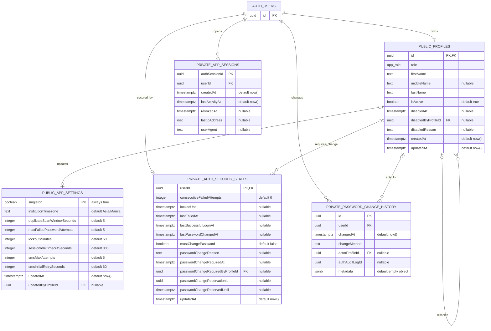
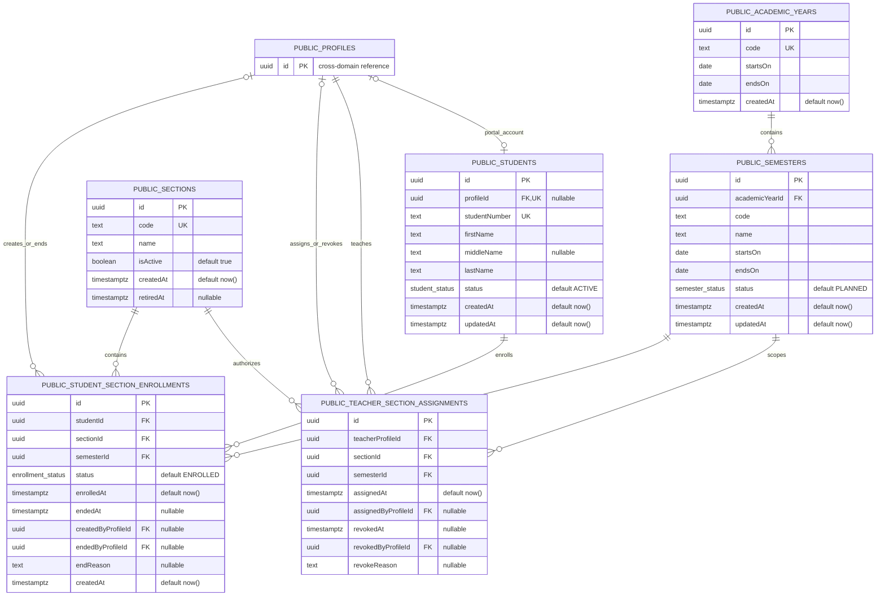
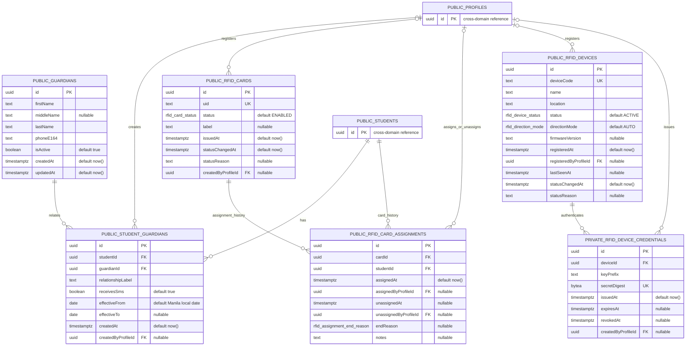
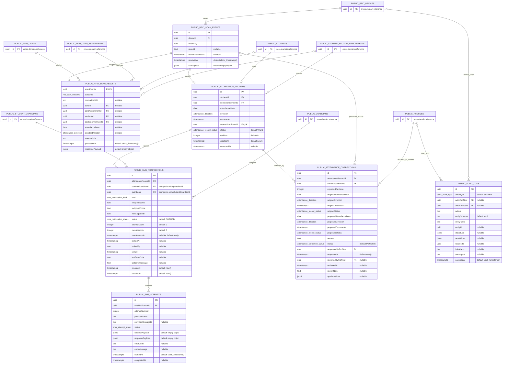

# Database Table Diagrams

Source of truth: [`20260806000100_initial_attendance_schema.sql`](../supabase/migrations/20260806000100_initial_attendance_schema.sql).

The project owns 24 tables: 20 in `public` and 4 in `private`. Supabase-managed `auth.users` is shown only as an external reference.

## Naming rule

- Table names remain `snake_case` so PostgreSQL schema objects stay conventional.
- Every table column uses `lowerCamelCase`. Single-word names such as `id`, `role`, `status`, and `code` are already valid lower camel case.
- PostgreSQL folds unquoted identifiers to lowercase. Therefore every multiword column must be double-quoted in SQL: `students."studentNumber"`, not `students.studentNumber`.
- `PK` = primary key, `FK` = foreign key, and `UK` = unique key. A `nullable` note means the column accepts `NULL`; otherwise it is `NOT NULL`.

## Complete inventory

| # | Table | Schema | Domain |
|---:|---|---|---|
| 1 | `profiles` | `public` | Identity and RBAC |
| 2 | `app_settings` | `public` | Runtime/security settings |
| 3 | `academic_years` | `public` | Academic calendar |
| 4 | `semesters` | `public` | Academic calendar |
| 5 | `sections` | `public` | BSIT sections |
| 6 | `students` | `public` | Student identity |
| 7 | `teacher_section_assignments` | `public` | Teacher authorization |
| 8 | `student_section_enrollments` | `public` | Enrollment history |
| 9 | `guardians` | `public` | Guardian identity |
| 10 | `student_guardians` | `public` | Student-guardian relationships |
| 11 | `rfid_cards` | `public` | RFID card registry |
| 12 | `rfid_card_assignments` | `public` | RFID assignment history |
| 13 | `rfid_devices` | `public` | Reader registry |
| 14 | `rfid_device_credentials` | `private` | Reader authentication secrets |
| 15 | `rfid_scan_events` | `public` | Immutable raw scans |
| 16 | `attendance_records` | `public` | Interpreted IN/OUT attendance |
| 17 | `rfid_scan_results` | `public` | Scan interpretation outcomes |
| 18 | `sms_notifications` | `public` | Durable SMS queue |
| 19 | `sms_attempts` | `public` | Provider attempt history |
| 20 | `attendance_corrections` | `public` | Correction ledger |
| 21 | `audit_logs` | `public` | Audit ledger |
| 22 | `auth_security_states` | `private` | Lockout/password state |
| 23 | `password_change_history` | `private` | Password-change history |
| 24 | `app_sessions` | `private` | Five-minute idle sessions |

## Identity, RBAC, and security

`AUTH_USERS` is not project-owned. It represents the minimum external key used from Supabase `auth.users`.



## Academic structure and authorization

`PUBLIC_PROFILES` is a cross-domain reference drawn above.



Important compound rules visible in the migration:

- `semesters`: unique (`academicYearId`, `code`); one partial-unique `ACTIVE` semester.
- `student_section_enrollments`: unique (`studentId`, `semesterId`) and unique (`id`, `studentId`).
- `teacher_section_assignments`: partial unique (`teacherProfileId`, `sectionId`, `semesterId`) while `revokedAt IS NULL`.
- `sections`: deferred trigger requires exactly five active sections at transaction commit.
- `students` is canonical for official student names; linked `profiles` names are trigger-maintained mirrors and reject direct divergence.

## Guardians, cards, and devices

`PUBLIC_STUDENTS` and `PUBLIC_PROFILES` are cross-domain references drawn above.



Important compound rules visible in the migration:

- `student_guardians` prevents overlapping effective periods for the same (`studentId`, `guardianId`).
- `student_guardians` has unique (`id`, `guardianId`) so notification rows cannot pair a relationship with the wrong guardian.
- `rfid_card_assignments` prevents overlapping assignment periods for both `cardId` and `studentId`.
- Partial unique indexes allow only one active assignment per card and one active card per student.
- RFID `uid` is canonical uppercase hexadecimal and globally unique.

## Scans, attendance, SMS, corrections, and audit

Small cross-domain reference boxes are included so every foreign-key path remains visible.



Important compound rules visible in the migration:

- `rfid_scan_events`: unique (`deviceId`, `eventKey`) provides database idempotency.
- Event-key replay also requires identical `rawUid`, `deviceScannedAt`, and `rawPayload`.
- `attendance_records`: unique `sourceScanEventId`; partial unique (`studentId`, `attendanceDate`, `direction`) while status is `VALID`.
- `sms_notifications`: unique (`attendanceRecordId`, `studentGuardianId`, `kind`).
- `sms_notifications`: composite (`studentGuardianId`, `guardianId`) FK enforces recipient relationship consistency.
- `sms_attempts`: unique (`smsNotificationId`, `attemptNumber`).
- Raw scans, scan results, SMS attempts, closed assignment history, password history, and audit rows are protected from destructive mutation.

## SQL example

Because multiword columns are case-sensitive quoted identifiers:

```sql
select
  s."studentNumber",
  s."firstName",
  s."lastName",
  ar."attendanceDate",
  ar."occurredAt"
from public.students as s
join public.attendance_records as ar
  on ar."studentId" = s.id;
```
